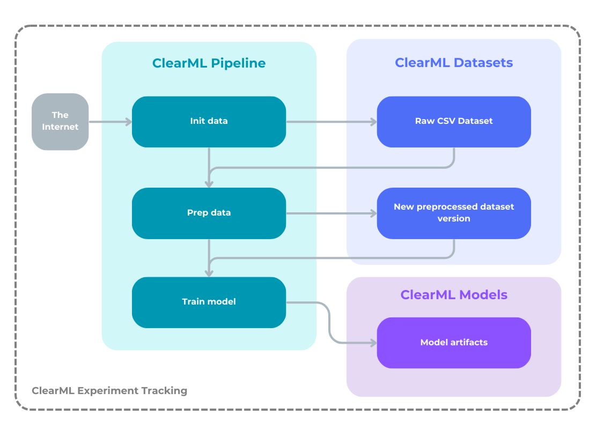
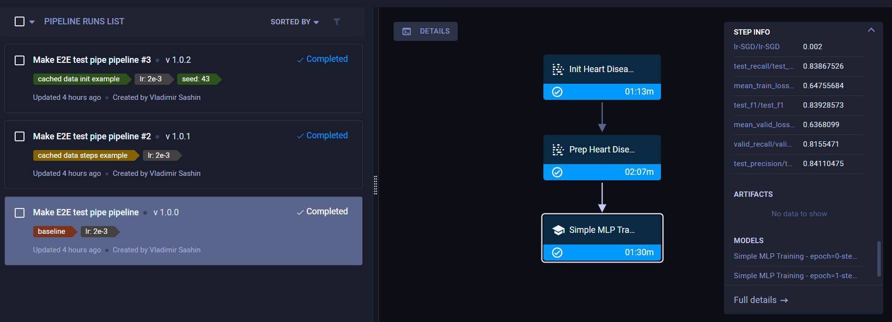

# Topological XAI research

<a href="https://www.pytorchlightning.ai/index.html"></a>
<a href="https://clear.ml/docs/latest/"></a>


## Getting started

1. Follow [instructions](https://github.com/python-poetry/install.python-poetry.org) to install Poetry. Check that poetry was installed successfully:
   ```bash
   poetry --version
   ```
1. Setup workspace.
   - Unix:
   ```bash
   make setup_ws
   ```
   - Windows:
   ```bash
   make setup_ws <path_to_your_python_3.10_executable>
   ```
1. Activate poetry virtual environment
   ```bash
   poetry shell
   ```
1. Init ClearML, [follow instructions](https://clear.ml/docs/latest/docs/getting_started/ds/ds_first_steps/)
   ```bash
   clearml-init
   ```

______________________________________________________________________

# Model training

1. **\[Only if running in ClearML pipeline mode\]** Initialize tasks in ClearML (details are in the `CLEARML INIT TASKS` section of [Makefile](Makefile)).
   ```bash
   make clearml_init_tasks
   ```
1. Run the pipeline
   ```bash
   make run_training
   ```

### Execution modes

There are 3 modes in which training can be executed, controlling the degree of tracking and versioning of experiments and artifacts.

1. ClearML pipeline (`run_mode: pipeline`)
1. Local (simple) mode (`run_mode: local`):
   - ClearML experiment tracking **enabled** (`track_in_clearml: true`)
   - ClearML experiment tracking **disabled** (`track_in_clearml: false`)

As well as all configurations, mode is selected in the config file.

### Configuration:

Both pre-processing and model training are configured in a single `.yaml` file, check [src/config.py](src/config.py) and [configs/heart_mlp_config.yaml](configs/heart_mlp_config.yaml) (used by default). You can provide an absolute path to the config in the `TRAIN_MLP_CFG_PATH` environment variable.

### Training pipeline (same for all mods):

1. Download initial raw data
1. Preprocess data
1. Train the model

<details>
  <summary>Preprocessing step details</summary>

1. Filter rows with non-positive values in selected columns that must be positive.
1. Tran/val/test split
1. Apply standardization to numeric variables
1. Apply one-hot encoding to categorical variables

</details>

______________________________________________________________________

## Training in ClearML pipeline mode details



When training is run in this mode, ClearML runs all pipeline steps as reproducible Tasks tracked in ClearML and chained with each other:

1. Init data: downloads raw CSV dataset from the internet and uploads it to ClearML, creating an easily accessible and traceable dataset in ClearML.
1. Preprocess data, upload it to ClearML and create a new preprocessed dataset version. In case of running experiments with different preprocessing configs, different versions will be created and connected with configs, Thus, all the data is tracked and versioned.
1. Run model training experiment, metrics will be tracked and model artifacts will be registered in ClearML.

Running ClearML pipeline ensures not only reproducibility, but also a full transparency of experiments by encapsulating, linking and tracking everything on each step: configuration, dataset versions, model artifacts, metrics, dependencies, `git` branch/commit and even uncommitted changes.

Additionally, data preprocessing steps are cached, so when you run training experiment with the same configuration and task version, these steps will be skipped.



______________________________________________________________________

## Training in local (simple) mode details

In case of this mode, training pipeline is fully handled by Lightning, so it is also reproducible and self-sufficient, but provides less tracking and versioning.

### 1. If ClearML tracking is enabled

The experiment is tracked almost the same way as in case of ClearML pipeline, but with the following differences:

1. Steps are not tracked and encapsulated by ClearML separately. Tracking starts with the first step and ends with the last. So there's 1 ClearML task per experiment, not 1 per each step, so steps cannot be reproduced separately by ClearML's task execution capabilities.
1. Dataset versions are not created in ClearML as a result of data init and data prep steps.

Thereby, this mode doesn't provide granular tracking of each step in ClearML and doesn't have data versioning, but still has experiment tracking enabled (config, logs, metrics and model artifacts, etc.).

Training in this mode runs faster than in ClearML pipeline mode.

### 2. If ClearML tracking is disabled

The same as the previous mode, but without any integration with ClearML, pure Lightning, but still self-sufficient and reproducible, with default Lightning logging/tracking to TensorBoard enabled. The fastest method, perfect for local experimentation and debugging.

______________________________________________________________________

## Note about temporary data

All the initially downloaded and pre-processed data is hierarchically structured and stored in the `data_tmp` directory for debugging and analysis purposes. **Keeping this data is NOT required for training in any mode**, because training is fully reproducible and self-sufficient thanks to ClearML and Lightning. So, the data from this directory can be safely removed at any time, the only recommendation is to keep the initial raw CSV file to avoid downloading every time in case of local training (file won't be downloaded if it already exists).

______________________________________________________________________

## Run Jupyter Lab

Configured to enable using CTRL+B to jump to code definitions

```bash
make jupyterlab_start
```

______________________________________________________________________

## Acknowledgments

`Lightning` code in this project was inspired by [Egor's](https://github.com/EgorOs) awesome [ml_refactoring_lecture repo](https://github.com/EgorOs/ml_refactoring_lecture/tree/main).
